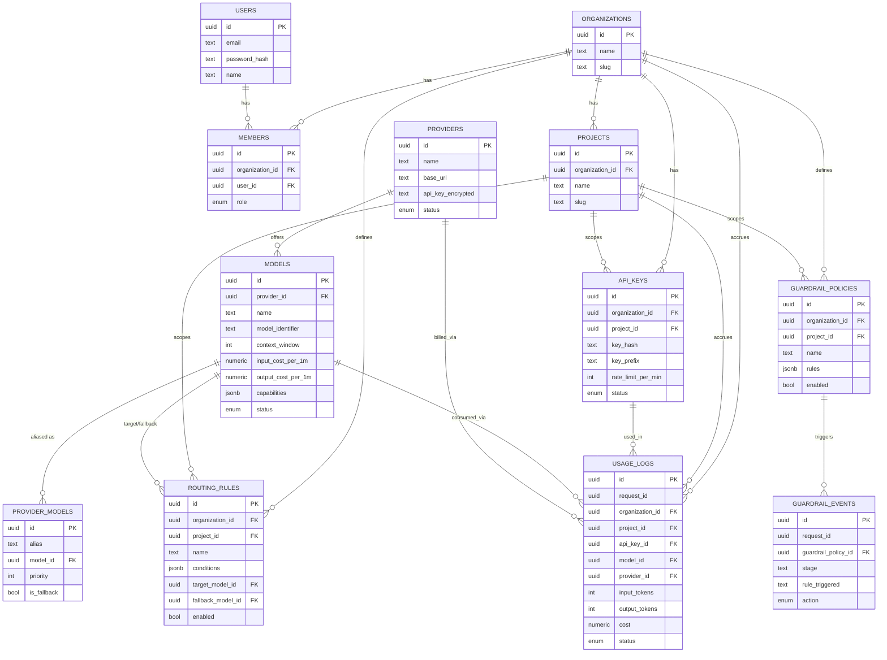

# AI Gateway — Schema ER Diagram




``` 
https://api.yourapp.com/v1
│
├── /organizations
│
├── /organizations/{slug}
│   ├── /members
│   ├── /api-keys
│   ├── /usage
│   └── /models
│
├── /providers
│
├── /models
│
├── /routing-rules
│
├── /guardrail-policies
│
└── /usage-logs
```
